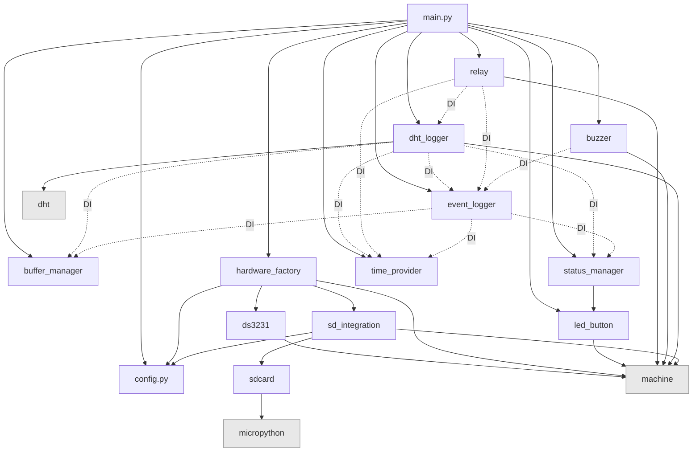

# Pi Greenhouse: AI Coding Agent Instructions

## Architecture overview



Solid arrows = import-time dependencies. Dashed arrows = runtime dependency injection.

### DI-first, async runtime
- `main.py` is the orchestrator: validates config via `validate_config()`, initialises hardware via `HardwareFactory`, composes providers/services, and spawns `uasyncio` tasks.
- Initialisation order (9 steps): validate config → `HardwareFactory.setup()` (RTC → SPI/SD → GPIO) → `RTCTimeProvider` → `StatusManager` → `BufferManager` → `EventLogger` → `DHTLogger` → `FanController` ×2 + `GrowlightController` + `BuzzerController` → `LEDButtonHandler` + `ServiceReminder` → spawn async tasks + health-check loop.
- Hardware is created **only** in `HardwareFactory`, then injected; no module-level hardware init anywhere.
- Time flows through `TimeProvider`/`RTCTimeProvider`; all timestamps and scheduling depend on it (never call `rtc.ReadTime()` directly outside the provider).
- Storage is centralised in `BufferManager`: writes to SD when available, falls back to `/local/fallback.csv`, buffers in RAM, and migrates fallback before new primary writes to preserve CSV ordering.

### Module responsibilities

| Module | Role | Logger? |
|--------|------|---------|
| `config.py` | `DEVICE_CONFIG` dict + `validate_config()` startup guard | No |
| `main.py` | Orchestrator: 9-step DI init + health-check loop | Yes (`"MAIN"`) |
| `lib/hardware_factory.py` | HW creation: RTC → SPI/SD → GPIO | Optional (`"HWFactory"`) |
| `lib/time_provider.py` | `TimeProvider`/`RTCTimeProvider` + sunrise/sunset | No |
| `lib/buffer_manager.py` | SD → fallback → RAM tiered writes | Optional (`"BufferMgr"`) |
| `lib/event_logger.py` | System log: INFO/WARN/ERR/DEBUG, flush, rotation | Self |
| `lib/dht_logger.py` | DHT22 reads, date-based CSV rollover | Yes (`"DHTLogger"`) |
| `lib/relay.py` | `RelayController` → `FanController`/`GrowlightController` | Yes |
| `lib/led_button.py` | LED control, button debounce, `ServiceReminder` | Optional (`"LEDButton"`) |
| `lib/status_manager.py` | 5 status LEDs + heartbeat + POST | Via optional `_logger` |
| `lib/buzzer.py` | Passive buzzer with named patterns | Yes (`"Buzzer"`) |
| `lib/sd_integration.py` | `mount_sd()`/`is_mounted()` helpers | No (low-level) |

## Logging conventions

### Severity levels
| Level | Token | When to use | Flush behaviour |
|-------|-------|-------------|-----------------|
| **DEBUG** | `[DEBUG]` | Development diagnostics, state snapshots, cycle ticks. **Console-only** by default (not written to SD unless `debug_to_file=True` in config) | Never auto-flushes |
| **INFO** | `[INFO]` | Normal operations, state transitions, startup milestones | After `info_flush_threshold` (default 5) entries |
| **WARN** | `[WARN]` | Recoverable issues, retries, degraded operation | After `warn_flush_threshold` (default 3) entries |
| **ERROR** | `[ERR]` | Failures requiring attention, data loss risk | **Immediate** flush + error LED |

### Log format
```
[YYYY-MM-DD HH:MM:SS] [LEVEL] [Module] message
```
Debug entries with structured fields:
```
[YYYY-MM-DD HH:MM:SS] [DEBUG] [Module] message | key1=value1 key2=value2
```

### Logging rules
- Modules that receive an `EventLogger` via DI should use `self.logger.info/warning/error/debug()`.
- Pre-logger-init code in `main.py` and `HardwareFactory` uses bare `print("[STARTUP] ...")`.
- Module tags match the class name: `"FanController"`, `"DHTLogger"`, `"BufferMgr"`, etc.
- Use DEBUG level liberally for AI-parseable diagnostics; it costs nothing when disabled.
- Never log secrets or raw binary data.

## Error handling patterns

### Pattern 1 — Async task loop (most controllers)
```python
while True:
    try:
        # ... main iteration logic ...
        await asyncio.sleep(interval)
    except asyncio.CancelledError:
        self.turn_off()  # graceful cleanup
        self.logger.warning("Module", "Task cancelled")
        raise  # re-raise for task teardown
    except Exception as e:
        self.logger.error("Module", f"Unexpected error: {e}")
        await asyncio.sleep(1)  # backoff, then retry
```
Used in: `FanController.start_cycle()`, `GrowlightController.start_scheduler()`, `DHTLogger.log_loop()`, `ServiceReminder.monitor()`.

### Pattern 2 — Retry with delay (sensor/SD reads)
```python
for attempt in range(max_retries):
    try:
        result = do_operation()
        return result
    except Exception as e:
        logger.warning("Module", f"Attempt {attempt+1} failed: {e}")
        if attempt < max_retries - 1:
            time.sleep(retry_delay)
return None  # all retries exhausted
```
Used in: `DHTLogger.read_sensor()`, `HardwareFactory._init_sd()`.

### Pattern 3 — Error accumulation (non-fatal init)
```python
self.errors = []
# ... in each _init_*() method:
except Exception as e:
    self.errors.append(f"Component failed: {e}")
    # continue setup; only RTC is fatal
```
Used in: `HardwareFactory.setup()`. Allows partial startup with degraded functionality.

### Pattern 4 — Multi-layer storage fallback
```python
try:
    write_to_sd(data)          # primary
except:
    try:
        write_to_fallback(data)  # /local/fallback.csv
    except:
        buffer_in_ram(data)      # last resort
```
Used in: `BufferManager.write()`.

### Pattern 5 — Graceful degradation
```python
try:
    component = Component(..., status_manager=status_manager)
except Exception:
    component = Component(..., status_manager=None)  # reduced functionality
```
Used in: `main.py` DHTLogger init.

### Error handling rules
- Always catch `asyncio.CancelledError` **separately** and re-raise it.
- Never swallow exceptions silently — log at WARNING minimum.
- Use `self.logger.error()` for errors that need human attention (triggers error LED).
- Prefer degraded operation over hard failure (the greenhouse must keep running).

## Project conventions

### Code style
- **Linter/formatter**: Ruff (rules E, F, I; line-length 120; target py311).
- **Naming**: `PascalCase` for classes, `snake_case` for functions/variables/files, `UPPER_SNAKE` for constants.
- **Type hints**: Optional — MicroPython doesn't use them at runtime, but add them where they help readability.

### Architecture rules
- **No module-level hardware init** — use dependency injection for testability.
- **Long-running logic** must be `uasyncio` tasks with `await asyncio.sleep()` (never blocking loops).
- **Relay GPIO is inverted**: `HIGH = off`, `LOW = on` across all relay controllers.
- **Prefer `BufferManager.write(relpath, data)`** with relative paths (e.g., `dht_log_YYYY-MM-DD.csv`), not absolute SD paths.
- **All tunable values** live in `DEVICE_CONFIG` inside `config.py`; `validate_config()` must check new keys.
- **CSV timestamps** use ISO-8601 format (`YYYY-MM-DD HH:MM:SS`) from `TimeProvider.now_timestamp()`.

### Config conventions
- Every new feature needs a section in `DEVICE_CONFIG` with sensible defaults.
- `validate_config()` must validate all new required keys and value ranges.
- Config keys use `snake_case`; section names use `snake_case` (exception: legacy `Service_reminder`).

### Commit conventions (Conventional Commits)
```
feat(relay): add CO2 controller with UART sensor
fix(buffer): handle SD removal during active write
refactor(logger): add DEBUG severity level
test(relay): add CO2 controller async loop tests
docs: update copilot instructions with logging conventions
ci: add GitHub Actions lint + test pipeline
```

## Testing conventions

### Framework
- `pytest` + `pytest-asyncio` (auto mode) + `pytest-cov` (threshold 88%) + `pytest-mock`.
- Config in `pyproject.toml`. Run: `pytest tests/ -v`.

### Test file structure
Every `lib/<module>.py` has a corresponding `tests/test_<module>.py`:
- **Class per unit**: `TestRelayController`, `TestFanController`, etc.
- **Fixture injection** from `tests/conftest.py` — every component has a fixture.
- **Async tests**: just write `async def test_*()` (auto mode handles the event loop).

### conftest.py fixture layers
1. **MicroPython stubs** (session-scoped): `machine`, `dht`, `micropython`, `uasyncio` patched into `sys.modules`.
2. **Time**: `mock_rtc`, `time_provider`, `base_time_provider` fixtures.
3. **Storage**: `buffer_manager(tmp_path)` — real filesystem in temp directory.
4. **Logging**: `event_logger` (real wired instance), `mock_event_logger` (lightweight Mock).
5. **Components**: `dht_logger`, `fan_controller`, `growlight_controller`, `buzzer_controller`, `led_handler`, `mock_status_manager`.

### Adding tests for a new controller (template)
1. **Fixture** in `conftest.py`: wire the controller with injected mocks.
2. **Initialization test**: verify all params stored correctly.
3. **State tests**: test on/off/toggle/`get_state()`.
4. **Async loop test**: run one iteration by patching `asyncio.sleep` to raise `RuntimeError("stop")`.
5. **CancelledError test**: verify graceful shutdown (turns off, re-raises).
6. **Unexpected error test**: verify error logged, loop continues.
7. **Edge cases**: boundary values, error conditions on sub-operations.

## Adding a new relay controller (recipe)

1. **Config**: add section in `DEVICE_CONFIG` with pin, intervals, thresholds. Add validation in `validate_config()`.
2. **Class**: subclass `RelayController` in `lib/relay.py`. Accept `pin`, `time_provider`, `logger` + module-specific config. Call `super().__init__(pin, invert=True, name=...)`.
3. **Async loop**: implement `start_<name>()` using Pattern 1 (async task loop with CancelledError).
4. **`get_state()`**: call `super().get_state()` then `state.update({...})` with module-specific fields.
5. **main.py wiring**: instantiate in Step 7 block, spawn with `asyncio.create_task()` in Step 9.
6. **conftest.py fixture**: wire with mock dependencies following existing patterns.
7. **Test file**: follow the class-per-controller template (init → state → async → error → edge cases).
8. **Docs**: update this file's module table and Mermaid diagram.

## Adding a new sensor (recipe)

1. **Config**: add section in `DEVICE_CONFIG` (pin, interval, retries, thresholds).
2. **Class**: new file `lib/<sensor>_logger.py`. Accept DI: `pin`, `time_provider`, `buffer_manager`, `logger`, optional `status_manager`.
3. **Read method**: implement retry with delay (Pattern 2).
4. **Log loop**: implement async loop (Pattern 1). Write CSV via `buffer_manager.write(relpath, data)`.
5. **CSV format**: header row on file creation; ISO-8601 timestamps; date-based rollover.
6. **main.py wiring**: instantiate after existing loggers, spawn task in Step 9.
7. **Host shim**: add simulated sensor data to `host_shims/` if the sensor needs a MicroPython driver.
8. **Tests + conftest fixture**: follow `test_dht_logger.py` patterns.

## Critical workflows

- **First run**: execute `rtc_set_time.py` on-device via Thonny to sync RTC.
- **Normal run**: execute `main.py` on-device via Thonny; check `/sd/dht_log_YYYY-MM-DD.csv` and `/sd/system.log`.
- **Host simulation**: `python main.py` on Windows/CPython; `host_shims/` auto-detected via `sys.implementation.name`; writes to `./sd/` and `./local/`.
- **Host tests**: `pytest tests/`; MicroPython modules mocked in `tests/conftest.py`.
- **Quality gate**: VS Code task `check` = lint → test → host-sim-smoke (all must pass before flash).

## Host shim behaviour
Host shims in `host_shims/` simulate MicroPython hardware on CPython/Windows:
- `machine.Pin`: logs state changes to console; tracks `value()` calls. `Pin.OUT/IN/PULL_UP/IRQ_FALLING` are integer constants.
- `machine.I2C/SPI`: no-op constructors returning mock objects.
- `machine.PWM`: tracks `freq()`/`duty_u16()`/`deinit()`.
- `dht.DHT22`: returns configurable fake temperature/humidity data.
- `os.mount/umount`: no-ops; file I/O goes to `./sd/` and `./local/` directories.
- `uasyncio`: wraps standard `asyncio` with MicroPython-compatible `sleep_ms()`.
- `micropython.const`: identity function (returns value unchanged).

## Integration points
- **MicroPython-only modules**: `machine`, `dht`, `uasyncio`; device drivers in `lib/` (`ds3231.py`, `sdcard.py`).
- **Vendored libs** (excluded from lint/test): `lib/picozero*`, `lib/sdcard.py`, `lib/ds3231.py`, `lib/ds2321_gen.py`.
- **Configuration**: `config.py` (`DEVICE_CONFIG`) — GPIO pins, schedules, thresholds, file paths.
- **Pre-commit**: Ruff lint+format on commit; pytest on push.
- **CI**: GitHub Actions runs lint → test → coverage → host-sim-smoke on push/PR.

## Hardware quick reference
| GPIO | Function | Logic |
|------|----------|-------|
| GP0–GP1 | CO2 UART (reserved) | — |
| GP2–GP3 | I2C1 (RTC + OLED) | — |
| GP4 | Activity LED | Active HIGH |
| GP5 | Reminder LED | Active HIGH |
| GP6 | SD-problem LED | Active HIGH |
| GP7 | Warning LED | Active HIGH |
| GP8 | Error LED | Active HIGH |
| GP9 | Menu button | Pull-up, active LOW |
| GP10–GP13 | SPI1 (SD card) | — |
| GP14 | Reserved button | — |
| GP15 | DHT22 data | — |
| GP16 | Fan relay 1 | **Inverted** (HIGH=off) |
| GP17 | Growlight relay | **Inverted** (HIGH=off) |
| GP18 | Fan relay 2 | **Inverted** (HIGH=off) |
| GP20 | Buzzer (PWM) | Active HIGH |
| GP25 | On-board LED | Active HIGH |
