# Mushroom Cultivation Process Flowcharts (Mermaid)

## 1. Overall Process Flow (High-Level)

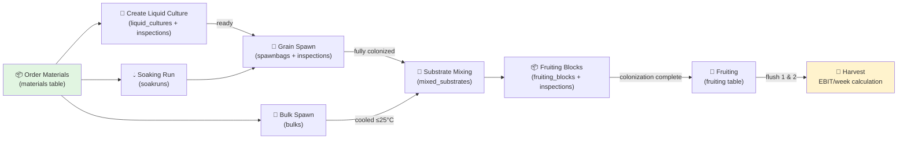

---

## QR Code Strategy (Manual vs App)

All processes that create trackable items (Liquid Cultures, Spawnbags, Fruiting Blocks, etc.) require unique QR code assignment. The approach differs by workflow:

### Manual Process (Current)

- **Step 1**: Create the record in database, generate unique ID
- **Step 2**: Manually record the ID on the physical QR code label (print or write)
- **Step 3**: Attach label to container
- **Database**: Store printed QR code string in table

### Smartphone App Process (Future)

- **Step 1**: Create the record in database, generate unique ID
- **Step 2**: Pre-printed QR codes exist (encoded with ID + table name as safety feature)
- **Step 3**: Worker scans the pre-printed QR code with phone
- **Database**: QR code automatically populated from scan (includes table context to prevent mislabeling)

**Safety Feature**: QR codes encode both the ID and the destination table (e.g., "SPAWNBAG:42" or "FBLOCK:128"), so scanning a wrong QR code type triggers a validation error.

---

## 2. Material Ordering Process (Two Stages)

### Step Requirements: Material Ordering

| Step | Operational requirement | Required data captured |
| ------ | -------------------------- | ------------------------ |
| Stage 1.1: Decide purchase channel | Worker chooses online shop or physical store | `material_type`, `vendor` |
| Stage 1.2: Record order details | Record order before receiving goods | `order_date`, `measuring_unit`, `amount_ordered`, `price_total`, `order_link` (online) or article number in `comments` (physical) |
| Stage 1.3: Create pending material record | Save as in-transit item | `delivery_date = NULL` |
| Stage 2.1: Verify delivery | Check item, quantity, condition | `comments` for discrepancies/issues |
| Stage 2.2: Confirm inventory | Mark material as received and usable | `delivery_date`, `amount_remaining`, `storage_location` |

### Stage 1: Order Placement & Recording

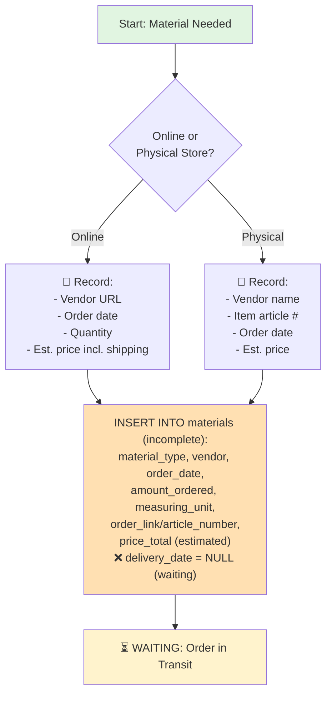

### Stage 2: Receiving & Verification

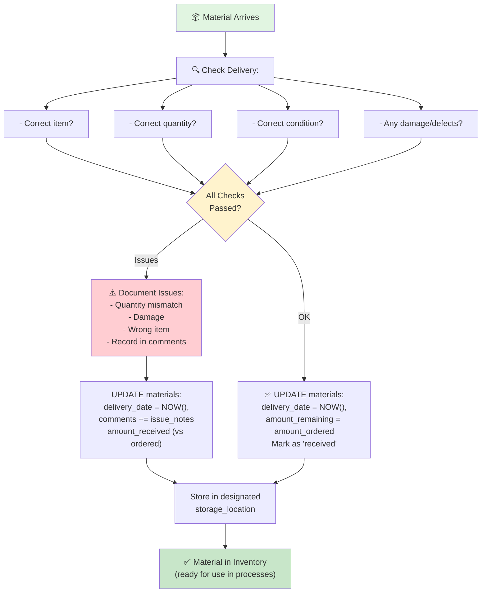

---

## 3. Liquid Culture Creation Process

### Step Requirements: Liquid Culture

| Step | Operational requirement | Required data captured |
| ------ | -------------------------- | ------------------------ |
| Step 1: Prepare nutrient solution | Mix ingredients and jar setup | Process notes in `comments` |
| Step 2: Sterilize and cool | Sterilize at 90 min @ 11 psi, cool to room temp | Process notes in `comments` |
| Step 3: Inoculate source | Use existing LC or spore print source | `datetime_inoculated`, `species`, `fk_source_liquid_culture_id` or `spore_print_source_location` |
| Step 4: Initialize inventory | Track usable LC volume | `amount_ml`, `amount_remaining_ml`, `status = active` |
| Step 5: Weekly monitoring | Record growth progression over time | `lc_growth_inspections.datetime_checked`, `colonization_percent`, `appearance`, `comments` |
| Step 6: Completion or discard | Week-6 rule and readiness state | `status`, `datetime_ready_for_use`, `sterility_check_passed` |

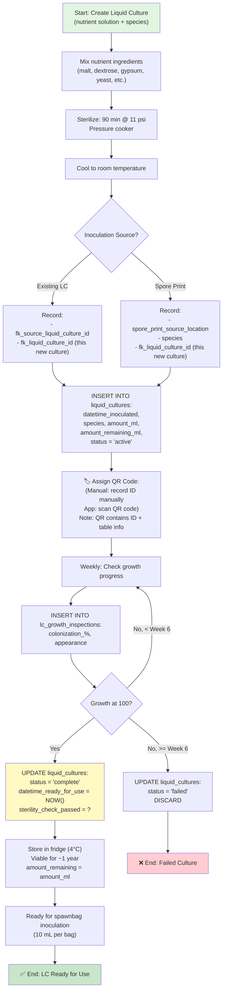

---

## 4. Soaking Process

### Step Requirements: Soaking

| Step | Operational requirement | Required data captured |
| ------ | -------------------------- | ------------------------ |
| Step 1: Start soakrun | Measure dry grain and start process | `datetime_started`, `fk_material_grain_id`, `weight_dry_grain` |
| Step 2: Soak management | Track manual stirs and water changes | `datetimes_stirs`, `datetimes_water_changes` |
| Step 3: Optional boil step | If applied, capture highest temperature reached when heat is turned off | `boil_applied`, `water_temp_max` |
| Step 4: Optional additives | Record any added materials and amounts | `additives_applied`, `comments` |
| Step 5: Finish soakrun | Record completion and germination sign | `datetime_finished`, `signs_of_germination` |

```mermaid
graph TD
    Start["Start: Soak Grain<br/>(typically barley, 6 kg target)"] --> Measure["Measure dry grain weight<br/>Record in soakruns table"]

    Measure --> Insert1["INSERT INTO soakruns:<br/>datetime_started,<br/>fk_material_grain_id,<br/>weight_dry_grain"]

    Insert1 --> Fill["Fill container with water<br/>Use worker-selected soak temperature"]

    Fill --> Stir1["Stir grain immediately (2 min)<br/>Record datetime_stirs if tracked"]

    Stir1 --> Drain1["Drain water"]

    Drain1 --> Refill["Refill container, submerge grain<br/>Let soak ~24 hours"]

    Refill --> Monitor["Monitor during 24h:<br/>Optional: change water, stir<br/>Record all datetimes"]

    Monitor --> Update1["UPDATE soakruns:<br/>datetimes_water_changes,<br/>datetimes_stirs (comma-delimited)"]

    Update1 --> After24h["After 24 hours (20-30h acceptable)"]

    After24h --> Check1{Signs of<br/>Germination?}

    Check1 -->|Yes| Drain2["Drain water thoroughly<br/>Record datetime_finished"]
    Check1 -->|No| Boil["Optional: Hot-water cook step<br/>Heat to 70-90°C<br/>Cool, drain 20 min<br/>Record water_temp_max,<br/>boil_applied = TRUE"]

    Boil --> AddOpt["Optional: Add gypsum or other<br/>Record additives_applied"]

    AddOpt --> Drain2
    Drain2 --> MixOpt["If additives used:<br/>Mix thoroughly<br/>Record in additives_applied"]

    MixOpt --> FinalCheck{Germination signs<br/>observed?}

    FinalCheck -->|Yes| UpdateFinal["UPDATE soakruns:<br/>signs_of_germination = TRUE"]
    FinalCheck -->|No| UpdateFinal

    UpdateFinal --> End["✅ End: Soaked Grain Ready<br/>For Spawnbag Process"]

    style Start fill:#e1f5e1
    style End fill:#c8e6c9
    style Boil fill:#ffe0b2
    style Monitor fill:#bbdefb
```

---

## 5. Grain Spawn Process (Spawnbag Creation & Inoculation)

### Step Requirements: Grain Spawn

| Step | Operational requirement | Required data captured |
| ------ | -------------------------- | ------------------------ |
| Step 1: Fill and identify bags | Record weight and binary order marking | `datetime_created`, `fk_soakrun_id`, `weight_filled`, `bag_number`, `binary_marking_pattern` |
| Step 2: Sterilize bags | Capture sterilization parameters and completion time | `sterilization_duration_min`, `sterilization_psi`, `datetime_sterilized`, `cooling_method` |
| Step 3: Attach trackable identity | Assign and store physical QR label | `qr_code` |
| Step 4: Inoculate with LC | Link bag to liquid culture and start timer | `datetime_inoculated`, `fk_liquid_culture_id` |
| Step 5: Update LC stock | Subtract inoculation volume | `liquid_cultures.amount_remaining_ml` |
| Step 6: Weekly health checks | Track growth, moisture, contamination history | `spawnbag_inspections.datetime_checked`, `colonization_percent`, `moisture_level`, `contamination_visible`, `status`, `comments` |

```mermaid
graph TD
    Start["Start: Create Spawn Bags<br/>From: Soakrun + Liquid Culture"] --> Fill["Fill spawnbags with soaked grain<br/>Target: 2.5 kg per bag"]

    Fill --> Weigh["Weigh filled bag"]

    Weigh --> Mark["Mark bag with binary pattern<br/>on filter pad corners:<br/>Bag 1: 0001, Bag 2: 0010, etc."]

    Mark --> Insert1["INSERT INTO spawnbags:<br/>datetime_created (now),<br/>fk_soakrun_id,<br/>weight_filled, bag_number,<br/>binary_marking_pattern"]

    Insert1 --> Batch["Batch bags for sterilization<br/>(2-3 at a time)"]

    Batch --> Sterilize["Sterilize in pressure cooker:<br/>90 min @ 11 psi<br/>Record: sterilization_duration_min,<br/>sterilization_psi"]

    Sterilize --> Cool["Cool SLOWLY:<br/>(stove off, lid on, no venting)<br/>Important for large bags!"]

    Cool --> UpdateSteril["UPDATE spawnbags:<br/>datetime_sterilized"]

    UpdateSteril --> Label["🏷️ Assign QR Code:<br/>(Manual: record unique ID manually<br/>App: scan printed QR code)<br/>Note: QR contains bag ID + table<br/>as safety feature"]

    Label --> Store["Sterilized bags can be stored<br/>indefinitely until inoculation"]

    Store --> Prep["Inoculation Prep:<br/>- Bring LC to room temp<br/>- Stir LC with magnetic stirrer<br/>- Wear nitrile gloves"]

    Prep --> Disinfect["Disinfect workspace + LC jar<br/>with isopropanol"]

    Disinfect --> Mount["Mount injection ports<br/>on spawnbags<br/>(spray ports with isopropanol first)"]

    Mount --> Steril["Heat sterilize syringe<br/>with blowtorch"]

    Steril --> Draw["Draw 10 mL LC into syringe"]

    Draw --> Inoculate["Inject into spawnbag<br/>via injection port"]

    Inoculate --> Insert2["UPDATE spawnbags:<br/>datetime_inoculated = NOW(),<br/>fk_liquid_culture_id = ?"]

    Insert2 --> Update_LC["UPDATE liquid_cultures:<br/>amount_remaining_ml -= 10"]

    Update_LC --> Store2["Move to inoculation storage<br/>(3+ weeks colonization)"]

    Store2 --> WeeklyCheck["Weekly: Inspect colonization"]

    WeeklyCheck --> Inspect["INSERT INTO spawnbag_inspections:<br/>colonization_%, moisture_level,<br/>contamination_visible, status"]

    Inspect --> Decision{Check Results}

    Decision -->|Contaminated| Discard["❌ DISCARD<br/>UPDATE spawnbag_inspections.status = 'contaminated'"]
    Decision -->|Slow growth @8 weeks| Discard
    Decision -->|Progressing well| WeeklyCheck
    Decision -->|100% Colonized| Complete["✅ 100 Colonized<br/>spawnbag_inspections.status = 'complete'<br/>Ready for Substrate Mixing"]

    Discard --> End1["❌ End: Failed Spawnbag"]
    Complete --> End2["✅ End: Spawn Bag Ready"]

    style Start fill:#e1f5e1
    style End2 fill:#c8e6c9
    style End1 fill:#ffcdd2
    style Steril fill:#fff9c4
```

---

## 6. Bulk Spawn Process

### Step Requirements: Bulk Spawn

| Step | Operational requirement | Required data captured |
| ------ | -------------------------- | ------------------------ |
| Step 1: Measure inputs | Measure all bulk components with real amounts | `fk_material_coco_coir_id`, `amount_coco_coir`, `fk_material_perlite_id`, `amount_perlite`, `fk_material_vermiculite_id`, `amount_vermiculite`, `fk_material_gypsum_id`, `amount_gypsum` |
| Step 2: Prepare water | Measure and boil process water | `water_volume` |
| Step 3: Pasteurize and cool | Pour boiling water and cool to safe mix temp | `datetime_created`, `datetime_cooled_below_25c` |
| Step 4: Finalize bulk batch | Store resulting batch metrics | `final_weight`, `comments` |

**Note**: This is a **parallel, independent process**. Does NOT depend on Liquid Culture or Grain Spawn.
It runs in parallel and only combines with Grain Spawn during Substrate Mixing.

```mermaid
graph TD
    Start["Start: Create Bulk Substrate<br/>(Pasteurized growing medium)"] --> Measure["Measure components:"]

    Measure --> Coco["Coco coir (typically 650g)<br/>Record: fk_material_coco_coir_id,<br/>amount_coco_coir"]
    Coco --> Perlite["Perlite (typically 200g)<br/>Record: fk_material_perlite_id,<br/>amount_perlite"]
    Perlite --> Vermiculite["Vermiculite (typically 50g)<br/>Record: fk_material_vermiculite_id,<br/>amount_vermiculite"]
    Vermiculite --> Gypsum["Gypsum (typically 15g)<br/>Record: fk_material_gypsum_id,<br/>amount_gypsum"]

    Gypsum --> Pot["Put all components in pot"]

    Pot --> Water["Measure water (typically 3.5L)<br/>Record: water_volume"]

    Water --> Boil["Bring water to heavy boil"]

    Boil --> Pour["Pour boiling water into pot<br/>with substrate components"]

    Pour --> Cover["Cover with lid immediately<br/>Maintain heat for sterilization"]

    Cover --> Cool["Cool to ≤25°C<br/>(typically 12+ hours)<br/>Record: datetime_cooled_below_25c"]

    Cool --> Insert["INSERT INTO bulks:<br/>datetime_created,<br/>datetime_cooled_below_25c,<br/>all amounts,<br/>final_weight"]

    Insert --> Ready["✅ Ready for Substrate Mixing<br/>Must be used immediately<br/>(no shelf life)"]

    style Start fill:#e1f5e1
    style Ready fill:#c8e6c9
    style Cool fill:#bbdefb
```

---

## 7. Substrate Mixing Process (Create Fruiting Blocks)

### Step Requirements: Substrate Mixing

| Step | Operational requirement | Required data captured |
| ------ | -------------------------- | ------------------------ |
| Step 1: Select source batches | Use one fully colonized spawnbag and one cooled bulk | `fk_spawnbag_id`, `fk_bulk_id`, `datetime_mixed` |
| Step 2: Prepare containers | Clean, sanitize, and prepare filter holes | `fk_material_container_id`, deviations in `comments` |
| Step 3: Fill fruiting blocks | Track each block as its own unit | `fruiting_blocks.datetime_created`, `fk_mixed_substrate_id`, `weight_at_creation`, `target_weight`, `qr_code`, `status` |
| Step 4: Record block count | Persist total blocks produced by this mix | `num_fruiting_blocks_created` |
| Step 5: Weekly colonization checks | Track moisture, growth, contamination over time | `fruiting_block_inspections.datetime_checked`, `colonization_percent`, `moisture_level`, `contamination_visible`, `status`, `comments` |

**Note**: This process combines the outputs of TWO independent parallel processes:

- **Grain Spawn** (spawnbag fully colonized with LC)
- **Bulk Spawn** (substrate cooled to ≤25°C)

```mermaid
graph TD
    Start["Start: Mix Substrate<br/>Combining two parallel processes:<br/>1 Spawnbag (fully colonized) + 1 Bulk (cooled)"] --> GetSpawn["Get fully colonized spawnbag<br/>(from Grain Spawn process)"]

    GetSpawn --> GetBulk["Get cooled bulk substrate<br/>(from Bulk Spawn process)"]

    GetBulk --> Insert1["INSERT INTO mixed_substrates:<br/>datetime_mixed,<br/>fk_spawnbag_id,<br/>fk_bulk_id"]

    Insert1 --> PrepContainers["Prepare fruiting block containers:<br/>- Clean"]

    PrepContainers --> Wipe["- Wipe with isopropanol (50mL est.)<br/>Record: fk_material_container_id"]

    Wipe --> Holes["- Add breathing holes with filter patches<br/>(standardized, note any deviations)"]

    Holes --> Break["Break up spawnbag grain"]

    Break --> Mix["Mix grain + bulk substrate<br/>in container"]

    Mix --> LoopStart["For each block created:"]

    LoopStart --> Weight["Weigh filled container"]

    Weight --> Target["Compare to target weight<br/>(TBD from testing)"]

    Target --> Label["🏷️ Assign QR Code:<br/>(Manual: record unique ID manually<br/>App: scan printed QR code)<br/>Note: QR contains block ID + table"]

    Label --> Insert2["INSERT INTO fruiting_blocks:<br/>datetime_created,<br/>fk_mixed_substrate_id,<br/>qr_code, weight_at_creation,<br/>status = 'colonizing')"]

    Insert2 --> Count["Increment num_fruiting_blocks_created"]

    Count --> Update_MS["UPDATE mixed_substrates:<br/>num_fruiting_blocks_created"]

    Update_MS --> Store["Store in colonization area<br/>(room temp, proper stacking)"]

    Store --> WeeklyCheck["Weekly: Inspect colonization"]

    WeeklyCheck --> Inspect["INSERT INTO fruiting_block_inspections:<br/>colonization_%, moisture_level,<br/>contamination_visible"]

    Inspect --> Decision{Check Results}

    Decision -->|Contaminated| Discard["❌ DISCARD<br/>UPDATE fruiting_block.status = 'disposed'<br/>disposal_reason = 'contamination'"]
    Decision -->|Slow growth @8 weeks| Discard
    Decision -->|Progressing| WeeklyCheck
    Decision -->|100 Colonized| Complete["✅ Complete colonization<br/>UPDATE fruiting_block.status = 'ready_to_fruit'<br/>datetime_colonization_complete"]

    Discard --> End1["❌ End: Failed Block"]
    Complete --> End2["✅ End: Block Ready for Fruiting"]

    style Start fill:#e1f5e1
    style End2 fill:#c8e6c9
    style End1 fill:#ffcdd2
```

---

## 8. Fruiting Process (Harvest)

### Step Requirements: Fruiting

| Step | Operational requirement | Required data captured |
| ------ | -------------------------- | ------------------------ |
| Step 1: Move block to chamber | Register fruiting start and position | `datetime_moved_to_chamber`, `fk_fruiting_block_id`, `chamber_location` |
| Step 2: Record flush 1 | Save first harvest timing and yield | `flush_number = 1`, `datetime_flush_occurred`, `weight_harvested` |
| Step 3: Record flush 2 or dispose | Save second flush if present, then dispose | `flush_number = 2`, `datetime_flush_occurred`, `weight_harvested`, `fruiting_blocks.status = disposed` |
| Step 4: Track timeout outcomes | If flush exceeds 4 weeks, discard and document | `comments`, `fruiting_blocks.disposal_reason` |
| Step 5: KPI reporting | Aggregate harvest outcomes for CI | harvest query outputs (grams/week, failures) |

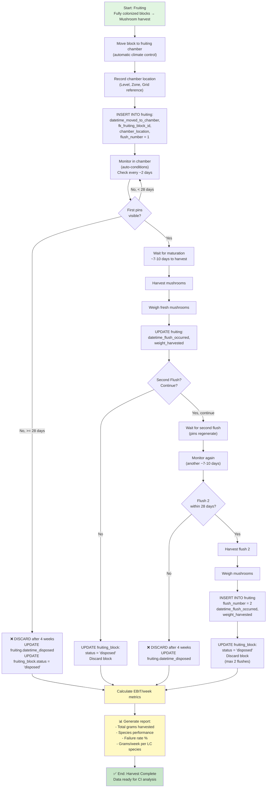

---

## 9. Database & Process Integration Map

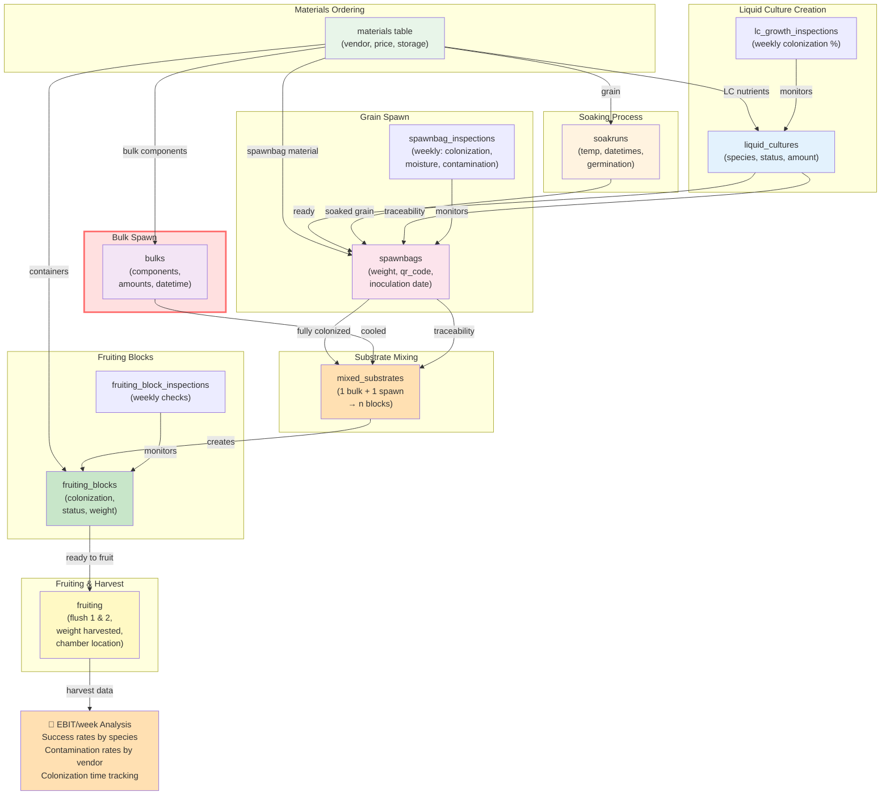

---

## 10. Inspection & Auto-Discard Decision Tree

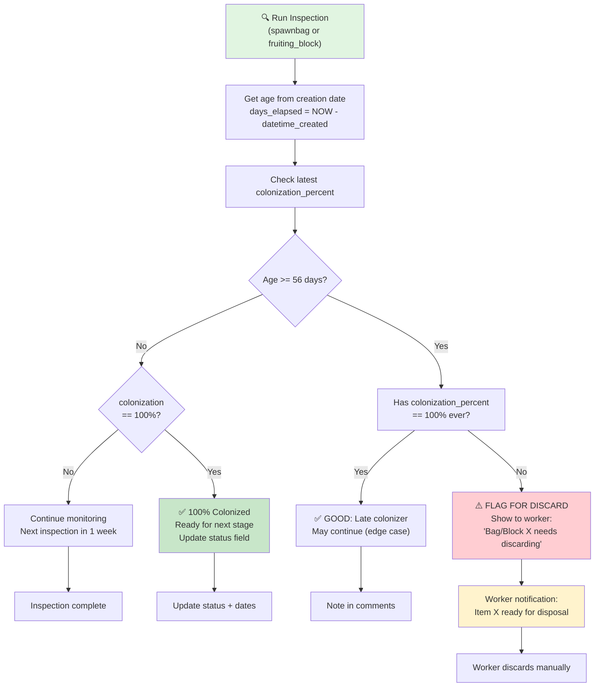

---

## Integration Checklist

✅ **All processes link to materials** → Every soakrun, bulk, spawnbag references material order IDs
✅ **Inspection tables track history** → spawnbag_inspections, fruiting_block_inspections, lc_growth_inspections
✅ **Auto-discard at 8 weeks** → Calculated at inspection time, flagged for worker
✅ **Traceability chain complete** → Harvest → Fruiting block → Mixed substrate → Spawn + Bulk → Materials
✅ **Comments column in all process tables** → Documents experiments & deviations
✅ **Picture paths for contamination** → Extensible for future smartphone app
✅ **EBIT/week metric** → Query: SUM(weight_harvested) / weeks for LC species, then cost-adjusted

---

## Next Steps

1. Create SQL schema (SQLite) from table definitions
2. Build CRUD endpoints (API layer for future smartphone app)
3. Create reporting dashboard queries (KPI tracking)
4. Implement inspection notification system (8-week auto-flag)
5. Plan photo storage strategy (local file system or cloud sync)
